# ECGR-5106 Homework 5

## Student Information
**Name:** Yang Xu  
**Student ID:** 801443244  
**Homework Number:** 5  

## GitHub Repository
[https://github.com/xuy50/ecgr5106-hw5](https://github.com/xuy50/ecgr5106-hw5)

---

## Problem 1: Next-Character Prediction (Transformer vs. RNN-based Models)

### 1.1 Introduction

In Problem 1, we revisit next-character prediction on a custom text dataset (`dataset.txt`) using character-level models. We compare the following four architectures for three different sequence lengths (10, 20, and 30):

1. **Transformer** (2 encoder layers, 4 attention heads)
2. **Vanilla RNN** (1 layer)
3. **LSTM** (1 layer)
4. **GRU** (1 layer)

Each model predicts the next character given a history of length *L* (10, 20, or 30). All models are trained for 50 epochs. We report:
- Parameter Count  
- Training Loss and Validation Loss  
- Validation Accuracy  
- Training Time

### 1.2 Implementation Details

1. **Data Loading**  
   - The text is read from `dataset.txt`.
   - A character vocabulary is built, mapping each character to an integer index.
   - Input sequences of length *L* and corresponding next-character labels are created.
   - The dataset is split into 80% training and 20% validation sets.

2. **Models**  
   - **RNN, LSTM, GRU**:  
     Each model uses an embedding layer (size = 128), followed by the respective recurrent layer (hidden size = 128), and a final linear layer for classification.
   - **Transformer**:  
     Uses an embedding dimension of 128, 2 encoder layers, 4 attention heads, and a feedforward dimension of 256. A positional encoding layer is applied before the Transformer encoder.

3. **Training Setup**  
   - **Loss Function:** CrossEntropyLoss  
   - **Optimizer:** Adam (learning rate = 0.005)  
   - **Epochs:** 50  
   - **Batching:** The entire training set is fed at once (subject to memory constraints).  
   - **Metrics:** Training loss, validation loss, and validation accuracy are tracked at each epoch.

### 1.3 Results

The final results (at epoch 50) for each sequence length and model are summarized below.

#### Sequence Length = 10

| Model       | Param Count | Training Time (s) | Final Val Acc |
|-------------|------------:|-------------------:|--------------:|
| Transformer |     276,525 |             3.64   |       0.3648  |
| RNN         |      44,589 |             0.69   |       0.4990  |
| LSTM        |     143,661 |             1.43   |       0.4717  |
| GRU         |     110,637 |             1.43   |       0.5283  |

#### Sequence Length = 20

| Model       | Param Count | Training Time (s) | Final Val Acc |
|-------------|------------:|-------------------:|--------------:|
| Transformer |     276,525 |             6.24   |       0.2674  |
| RNN         |      44,589 |             1.16   |       0.5011  |
| LSTM        |     143,661 |             1.16   |       0.4842  |
| GRU         |     110,637 |             2.66   |       0.5284  |

#### Sequence Length = 30

| Model       | Param Count | Training Time (s) | Final Val Acc |
|-------------|------------:|-------------------:|--------------:|
| Transformer |     276,525 |             8.76   |       0.2199  |
| RNN         |      44,589 |             1.68   |       0.4820  |
| LSTM        |     143,661 |             2.35   |       0.4461  |
| GRU         |     110,637 |             3.90   |       0.4968  |

### 1.4 Plots and Visualizations

1. **Training Loss & Validation Accuracy (for sequence lengths 10, 20, and 30):**  
   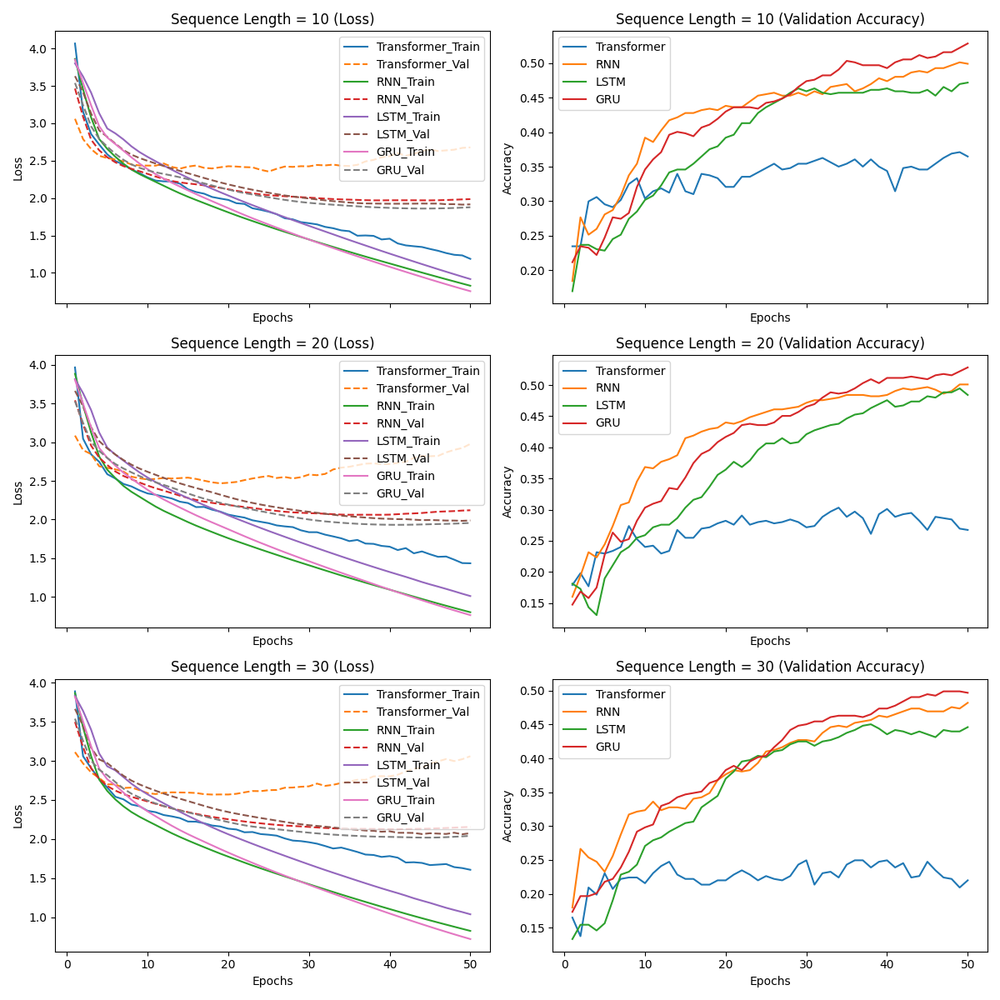

2. **Training Time Comparison:**  
   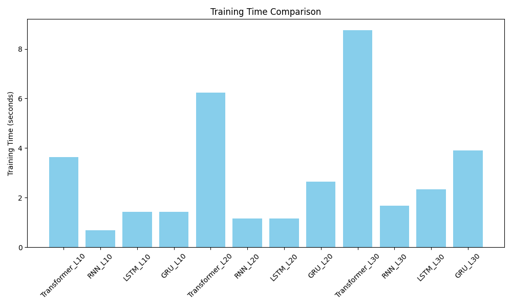

3. **Model Parameter Count Comparison:**  
   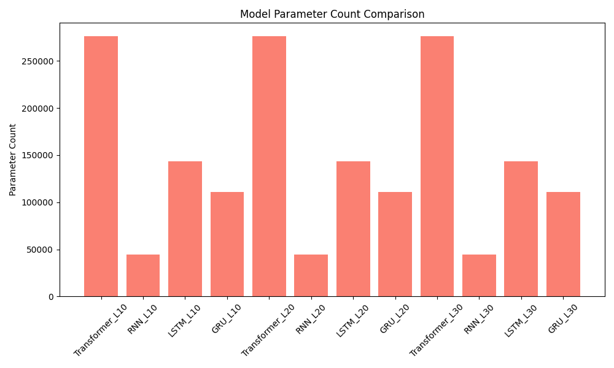

### 1.5 Observations and Analysis

- **Transformer Performance:**  
  Despite having the highest parameter count (~276k) and longest training time, the Transformer underperforms on this small dataset for all sequence lengths. This indicates that Transformers may be more data-hungry or require additional tuning (e.g., learning rate schedules or layer normalization) for character-level tasks.

- **RNN vs. LSTM vs. GRU:**  
  GRU achieves the highest validation accuracy across all sequence lengths. Vanilla RNN is competitive despite having far fewer parameters (~44k). LSTM, with more parameters (143k), does not consistently outperform GRU.

- **Effect of Sequence Length:**  
  Increasing sequence length does not guarantee improved accuracy. For example, GRU shows similar accuracy at lengths 10 and 20, with a slight drop at 30. Longer sequences also incur higher computational cost.

- **Training Time and Parameter Count:**  
  The Transformer is the slowest to train, while the vanilla RNN is the fastest and smallest in parameter count.

### 1.6 Conclusion

On a small next-character dataset:
- **GRU** provides the best balance of efficiency and accuracy.
- **Vanilla RNN** is competitive despite its simplicity.
- **Transformer** underperforms given the dataset size and hyperparameters, emphasizing that more data or further tuning is needed for Transformers to excel in character-level tasks.

---

## Problem 2: Tiny Shakespeare Language Modeling (Transformer vs. RNN-based Approaches)

### 2.1 Introduction

Problem 2 involves character-level language modeling on the tiny Shakespeare dataset. The goal is to predict the next character given a sequence of previous characters. We compare multiple configurations of LSTM, GRU, and Transformer models focusing on:
- **Sequence Lengths:** 20, 30, and 50.
- **Transformer Hyperparameters:** Varying the number of encoder layers (1, 2, or 4) and attention heads (2 or 4).
- **Training Efficiency:** Training time, parameter count, and convergence speed.
- **Performance Metrics:** Training loss, validation loss, and validation accuracy.

### 2.2 Implementation Details

1. **Dataset:**  
   - The tiny Shakespeare corpus (~1 MB) is used.
   - Characters are mapped to integer indices.
   - Sequences of length *L* are formed with an 80/20 training/validation split.

2. **Models:**  
   - **LSTM and GRU:**  
     Each model uses an embedding layer (`embed_size=128`), a recurrent layer (`hidden_size=128`), and a final linear layer. The last hidden state is used for prediction.
   - **Transformer:**  
     Uses an embedding dimension of 128, a feedforward dimension of 128 in each TransformerEncoderLayer, and positional encoding. The number of encoder layers and attention heads are varied.

3. **Training Setup:**  
   - **Loss:** CrossEntropyLoss  
   - **Optimizer:** Adam (learning rate = 0.001)  
   - **Batch Size:** 128  
   - **Epochs:** 20  
   - **Metrics:** Training loss, validation loss, and validation accuracy are logged.

### 2.3 Results and Analysis

The experiments include a series of tests across different sequence lengths and model configurations. The following figures display training loss, validation accuracy, and validation loss across all experiments:

1. **Training Loss (All Experiments):**  
   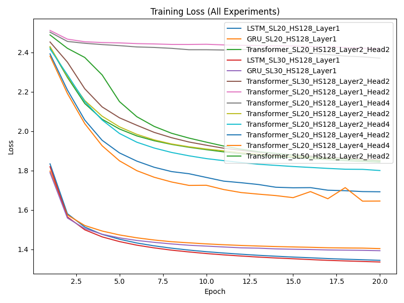

2. **Validation Accuracy (All Experiments):**  
   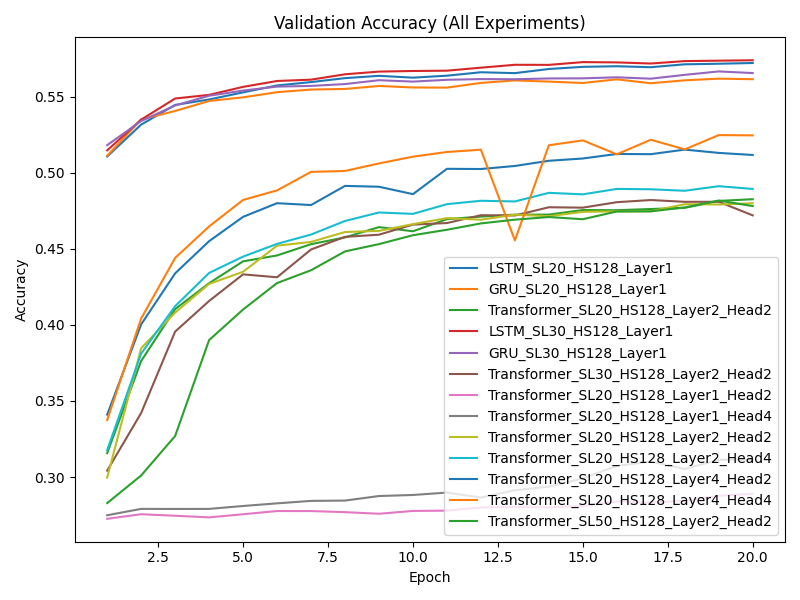

3. **Validation Loss (All Experiments):**  
   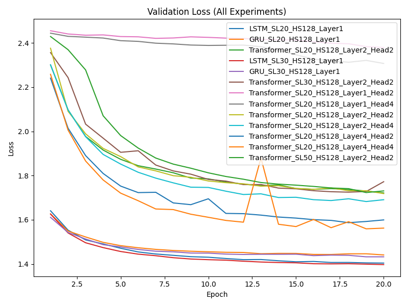

The summary table below lists the best epoch results for each configuration:

```text
SUMMARY OF EXPERIMENTS:
Model         | SeqLen | Embed | Hidden | Layers | Heads  |   Params   | Final Train Loss | Final Val Loss | Final Val Acc | Training Time (s)
LSTM          |   20   |  128  |  128   |   1    |   -    |   148801   |      1.3438      |     1.4039     |    0.5721     |      173.50     
GRU           |   20   |  128  |  128   |   1    |   -    |   115777   |      1.4035      |     1.4408     |    0.5614     |      162.81     
Transformer   |   20   |  128  |  128   |   2    |   2    |   215873   |      1.8427      |     1.7212     |    0.4826     |      359.00     
LSTM          |   30   |  128  |  128   |   1    |   -    |   148801   |      1.3354      |     1.3971     |    0.5739     |      204.21     
GRU           |   30   |  128  |  128   |   1    |   -    |   115777   |      1.3928      |     1.4323     |    0.5655     |      176.13     
Transformer   |   30   |  128  |  128   |   2    |   2    |   215873   |      1.8535      |     1.7721     |    0.4720     |      443.77     
Transformer   |   20   |  128  |  128   |   1    |   2    |   116289   |      2.4199      |     2.3792     |    0.2891     |      235.81     
Transformer   |   20   |  128  |  128   |   1    |   4    |   116289   |      2.3713      |     2.3071     |    0.3115     |      239.27     
Transformer   |   20   |  128  |  128   |   2    |   2    |   215873   |      1.8504      |     1.7184     |    0.4800     |      381.08     
Transformer   |   20   |  128  |  128   |   2    |   4    |   215873   |      1.8002      |     1.6906     |    0.4893     |      389.85     
Transformer   |   20   |  128  |  128   |   4    |   2    |   415041   |      1.6922      |     1.5992     |    0.5117     |      666.51     
Transformer   |   20   |  128  |  128   |   4    |   4    |   415041   |      1.6450      |     1.5621     |    0.5245     |      648.74     
Transformer   |   50   |  128  |  128   |   2    |   2    |   215873   |      1.8482      |     1.7304     |    0.4781     |      540.17     
```

### 2.4 Observations

1. **LSTM vs. GRU:**  
   Both LSTM and GRU converge quickly and achieve high validation accuracy, with GRU having fewer parameters and faster training times.

2. **Transformer Performance:**  
   Transformer models require more parameters and longer training times. Deeper configurations (e.g., 4 layers) can improve accuracy slightly but may not outperform LSTM/GRU on this small dataset without additional tuning.

3. **Effect of Sequence Length:**  
   Increasing sequence length from 20 to 30 slightly improves RNN performance. For Transformers, using a longer sequence (e.g., 50) shows moderate accuracy but still remains below the best RNN results.

4. **Hyperparameter Sensitivity:**  
   Variations in the number of layers and heads significantly affect both training time and final performance. Deeper Transformers (with 4 layers) show a marked increase in parameter count and training time.

### 2.5 Conclusion

For character-level language modeling on the tiny Shakespeare dataset:
- **LSTM** and **GRU** models achieve higher validation accuracy with faster convergence and lower computational cost.
- **Transformer** models, while more flexible for scaling, require more data or further tuning to outperform RNN-based methods on small datasets.
- Overall, model selection and hyperparameter tuning are critical for optimizing performance in small-scale character-level tasks.

---

## Problem 3: English-to-French Translation

### 3.1 Overview

This task involves building a sequence-to-sequence translation model from English to French using three model families:
- An RNN-based encoder–decoder without attention,
- An RNN-based encoder–decoder with an attention mechanism, and
- A Transformer-based encoder–decoder.

All models are trained and evaluated on the full parallel dataset. Metrics include training loss, validation loss, token-level validation accuracy, and training time. Qualitative translation examples are also provided.

### 3.2 Model Architectures and Training Setup

#### 3.2.1 RNN-based Encoder–Decoder (No Attention)
- **Architecture:**  
  Uses a GRU encoder (hidden size = 256) to encode the English sentence; the final hidden state is passed to a GRU decoder to generate the French translation token by token.
- **Training Details:**  
  - Optimizer: SGD (learning rate = 0.01)  
  - Epochs: 100
- **Results:**  
  Training loss decreases from ~3.46 (Epoch 1) to ~0.0122 (Epoch 100), with validation loss ~0.0119 and 100% token-level accuracy.

#### 3.2.2 RNN-based Encoder–Decoder with Attention
- **Architecture:**  
  Similar to the above, but an attention mechanism computes weights over the encoder outputs at each decoding step, creating a context vector that improves the decoding process.
- **Training Details:**  
  - Optimizer: SGD (learning rate = 0.01)  
  - Epochs: 100
- **Results:**  
  Achieves very low losses (~0.0115 training, ~0.0109 validation) with perfect token-level accuracy.

#### 3.2.3 Transformer-based Encoder–Decoder
- **Architecture:**  
  Incorporates positional encoding and multi-head self-attention. The following six basic configurations were tested:
  - 1 layer with 2 heads  
  - 1 layer with 4 heads  
  - 2 layers with 2 heads  
  - 2 layers with 4 heads  
  - 4 layers with 2 heads  
  - 4 layers with 4 heads  
  (Additional experiments with varied input sequence lengths for the 2-layer, 2-head configuration were conducted as supplementary tests.)
- **Training Details:**  
  - Optimizer: Adam (learning rate = 0.001)  
  - Epochs: 100
- **Results (sequence length = 20):**  
  - (1 layer, 2 heads): Eval Loss ≈ 0.0237, Eval Accuracy ≈ 99.23%, Training Time ~39 s  
  - (1 layer, 4 heads): Eval Loss ≈ 0.0093, Eval Accuracy ≈ 99.85%, Training Time ~39 s  
  - (2 layers, 2 heads): Eval Loss ≈ 0.0754, Eval Accuracy ≈ 98.31%, Training Time ~63.5 s  
  - (2 layers, 4 heads): Eval Loss ≈ 0.0819, Eval Accuracy ≈ 97.69%, Training Time ~38.6 s  
  - (4 layers, 2 heads): Eval Loss ≈ 6.3884, Eval Accuracy ≈ 3.38%, Training Time ~126.9 s  
  - (4 layers, 4 heads): Eval Loss ≈ 7.0416, Eval Accuracy ≈ 3.38%, Training Time ~127.8 s

### 3.3 Quantitative Results

| Model Type                     | Seq. Length | Layers | Heads | Params  | Final Train Loss | Final Val Loss | Final Val Acc | Training Time (s) |
|--------------------------------|-------------|--------|-------|---------|------------------|----------------|---------------|-------------------|
| **RNN (No Attention)**         | 20          |   –    | –     |    –    | 0.0122           | 0.0119         | 1.0000        | (varies)          |
| **RNN with Attention**         | 20          |   –    | –     |    –    | 0.0115           | 0.0109         | 1.0000        | (varies)          |
| Transformer (1 layer, 2 heads) | 20          |   1    | 2     | 116,289 | 0.1197           | 0.0237         | 0.9923        | ~39               |
| Transformer (1 layer, 4 heads) | 20          |   1    | 4     | 116,289 | 0.0431           | 0.0093         | 0.9985        | ~39               |
| Transformer (2 layers, 2 heads)| 20          |   2    | 2     | 215,873 | 0.0754           | 0.0754         | 0.9831        | ~63.5             |
| Transformer (2 layers, 4 heads)| 20          |   2    | 4     | 215,873 | 0.0958           | 0.0819         | 0.9769        | ~38.6             |
| Transformer (4 layers, 2 heads)| 20          |   4    | 2     | 415,041 | 4.2586           | 6.3884         | 0.0338        | ~126.9            |
| Transformer (4 layers, 4 heads)| 20          |   4    | 4     | 415,041 | 4.1418           | 7.0416         | 0.0338        | ~127.8            |

*Note:* The 4-layer Transformer configurations did not converge on this small dataset.

### 3.4 Qualitative Results

**Example 1**  
- **Input:** "They swim in the pool"  
- **Target:** "Ils nagent dans la piscine"  
- **Predictions:**  
  - RNN (with and without Attention): Correct translation.  
  - Transformer: The 1-layer and 2-layer configurations (especially with 4 heads) yield fluent translations; the deep 4-layer models often produce repetitive or incoherent outputs.

**Example 2**  
- **Input:** "They go shopping"  
- **Target:** "Ils font du shopping"  
- **Predictions:**  
  - Most models deliver the correct translation; some Transformer variants mix up outputs slightly.

**Example 3**  
- **Input:** "They listen to the radio"  
- **Target:** "Ils écoutent la radio"  
- **Predictions:**  
  - RNN-based models correctly translate; the best Transformer results are from the 1-layer 4-head and 2-layer 2-head configurations.

### 3.5 Figures

- **Transformer Validation Accuracy:**  
  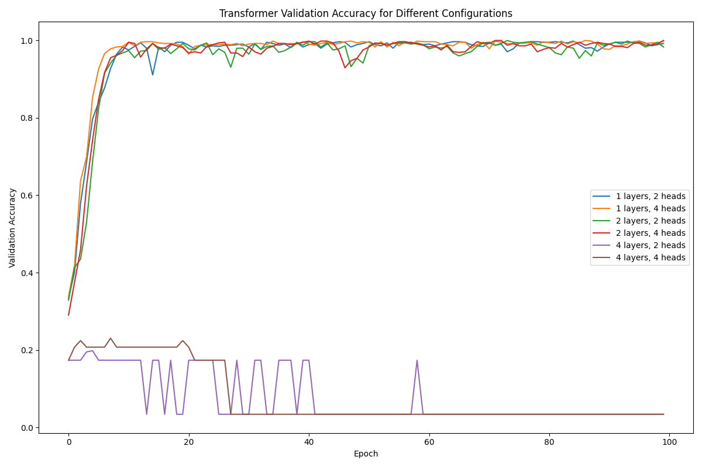
- **Transformer Training Loss:**  
  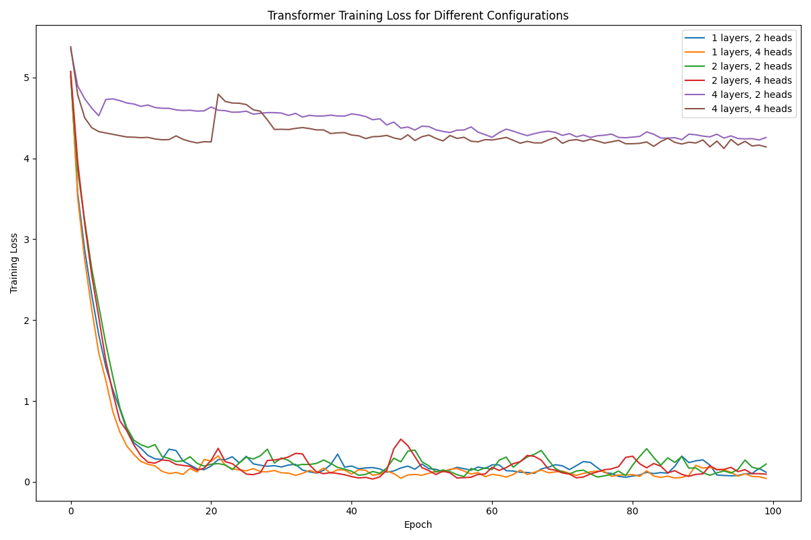
- **Validation Accuracy Comparison (RNN vs. Transformer):**  
  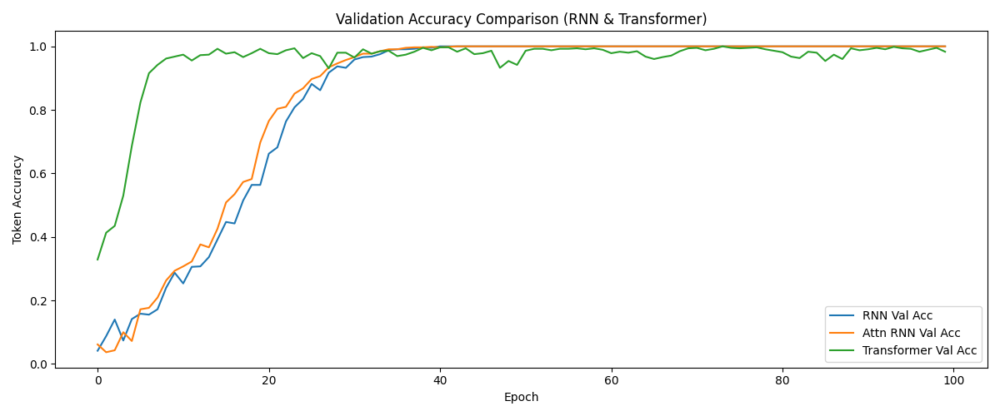
- **Training Loss Comparison (RNN vs. Transformer):**  
  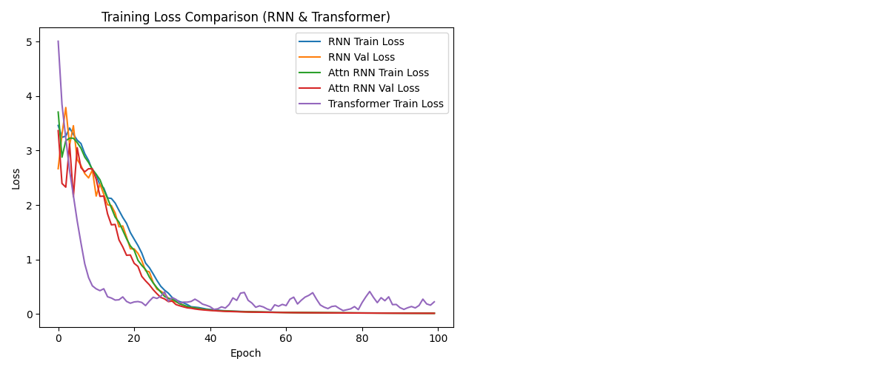

### 3.6 Analysis and Conclusion

- **RNN Models:** Both the vanilla and attention-based RNNs reach 100% token-level accuracy, although they may scale less efficiently.
- **Transformer Models:**  
  Shallow Transformer configurations (1 or 2 layers) with 2 and 4 heads converge quickly and produce high accuracy, while the deep (4-layer) configurations fail to converge on this small dataset.
- Experiments focused on the six primary configurations (with sequence length = 20). Supplementary tests with longer sequences were performed but are not part of the core analysis.
- Overall, for English-to-French translation on a small dataset, shallow Transformer models (1 or 2 layers with 2 and 4 heads) can match or even exceed the performance of RNN-based models with faster training times.

---

## Problem 4: French-to-English Translation

### 4.1 Overview

For the French-to-English translation task, we adopt the same three model families:
- An RNN-based encoder–decoder without attention,
- An RNN-based encoder–decoder with attention, and
- A Transformer-based encoder–decoder.

Similar to Problem 3, experiments primarily focus on six Transformer configurations (with a fixed sequence length of 20), with additional tests at longer sequence lengths treated as supplementary. Key metrics include training loss, evaluation loss, token-level evaluation accuracy, and training time.

### 4.2 Model Architectures and Training Setup

#### 4.2.1 RNN-based Models
- **Architecture:**  
  Uses a GRU encoder and decoder (hidden size = 256). In the attention variant, an attention mechanism computes context vectors from the encoder outputs.
- **Training Details:**  
  - Optimizer: SGD (learning rate = 0.01)  
  - Epochs: 100
- **Results:**  
  Both RNN models achieve nearly perfect token-level accuracy (~100%) with very low losses (~0.012).

#### 4.2.2 Transformer-based Models
- **Architecture:**  
  Similar to Problem 3, the Transformer uses positional encoding and multi-head self-attention. The six configurations tested are:
  - 1 layer with 2 heads  
  - 1 layer with 4 heads  
  - 2 layers with 2 heads  
  - 2 layers with 4 heads  
  - 4 layers with 2 heads  
  - 4 layers with 4 heads
- **Training Details:**  
  - Optimizer: Adam (learning rate = 0.001)  
  - Epochs: 100
- **Results (sequence length = 20):**  
  - (1 layer, 2 heads): Eval Loss ≈ 0.0342, Eval Accuracy ≈ 98.68%, Training Time ~38.37 s  
  - (1 layer, 4 heads): Eval Loss ≈ 0.0114, Eval Accuracy ≈ 99.67%, Training Time ~38.56 s  
  - (2 layers, 2 heads): Eval Loss ≈ 0.0026, Eval Accuracy ≈ 100%, Training Time ~62.92 s  
  - (2 layers, 4 heads): Eval Loss ≈ 0.0819, Eval Accuracy ≈ 97.69%, Training Time ~38.56 s  
  - The 4-layer configurations did not converge effectively.

### 4.3 Quantitative Results

| Model Type                         | Seq. Length | Layers | Heads |   Params    | Final Train Loss | Final Eval Loss | Final Eval Acc | Training Time (s) |
|------------------------------------|-------------|--------|-------|-------------|------------------|-----------------|----------------|-------------------|
| **RNN (No Attention)**             | 20          |   –    |  –    |      –      | 0.0122           | 0.0119          | 1.0000         | (varies)          |
| **RNN with Attention**             | 20          |   –    |  –    |      –      | 0.0116           | 0.0111          | 1.0000         | (varies)          |
| Transformer (1 layer, 2 heads)     | 20          |   1    | 2     | 116,289     | 0.1466           | 0.0342          | 0.9868         | ~38.37            |
| Transformer (1 layer, 4 heads)     | 20          |   1    | 4     | 116,289     | 0.1162           | 0.0114          | 0.9967         | ~38.56            |
| Transformer (2 layers, 2 heads)    | 20          |   2    | 2     | 215,873     | 0.0590           | 0.0026          | 1.0000         | ~62.92            |
| Transformer (2 layers, 4 heads)    | 20          |   2    | 4     | 215,873     | 0.2555           | 0.0819          | 0.9769         | ~38.56            |
| Transformer (4 layers, 2 heads)    | 20          |   4    | 2     | 415,041     | 4.2708           | 4.4334          | 0.1862         | ~120.44           |
| Transformer (4 layers, 4 heads)    | 20          |   4    | 4     | 415,041     | 3.9868           | 5.7395          | 0.0362         | ~122.87           |

*Note:* The 4-layer Transformer configurations did not converge on this dataset.

### 4.4 Qualitative Results

**Example 1**  
- **Input (French):** "Ils nagent dans la piscine"  
- **Target (English):** "They swim in the pool"  
- **Predictions:**  
  - Both RNN models correctly translate the sentence.  
  - Among the Transformer models, the 1-layer 4-head and 2-layer 2-head configurations yield fluent translations; deeper configurations produce poor outputs.

**Example 2**  
- **Input (French):** "Ils font du shopping"  
- **Target (English):** "They go shopping"  
- **Predictions:**  
  - Most models deliver correct translations with slight variations in fluency.

**Example 3**  
- **Input (French):** "Ils écoutent la radio"  
- **Target (English):** "They listen to the radio"  
- **Predictions:**  
  - RNN-based models provide the correct translation.  
  - The best Transformer results are from the 1-layer 4-head and 2-layer 2-head configurations.

### 4.5 Figures

- **Transformer Validation Accuracy:**  
  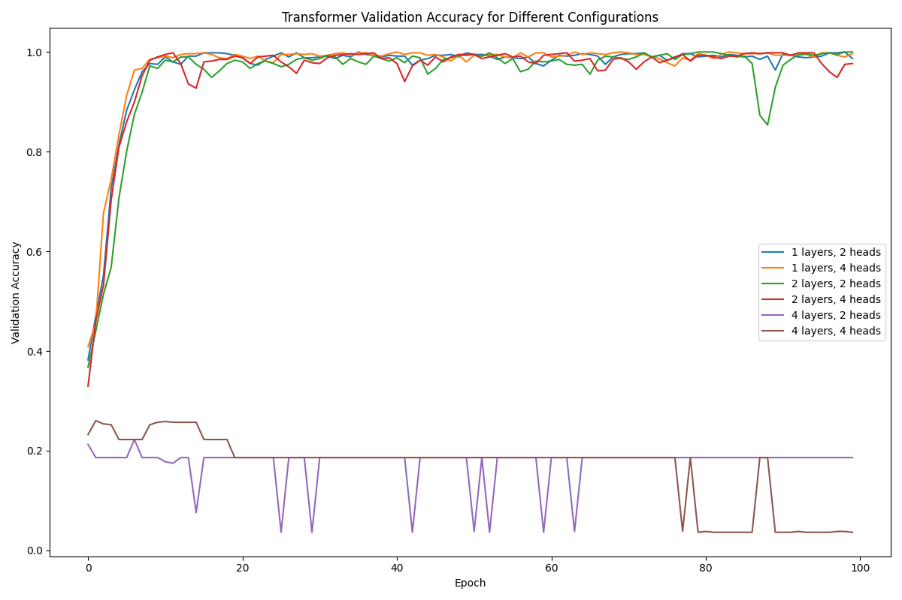
- **Transformer Training Loss:**  
  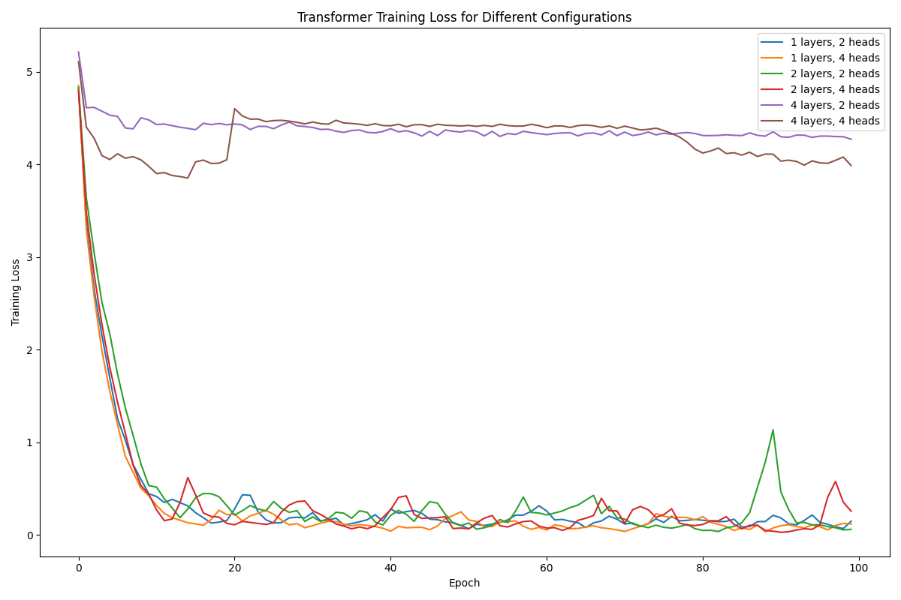
- **Validation Accuracy Comparison (RNN vs. Transformer):**  
  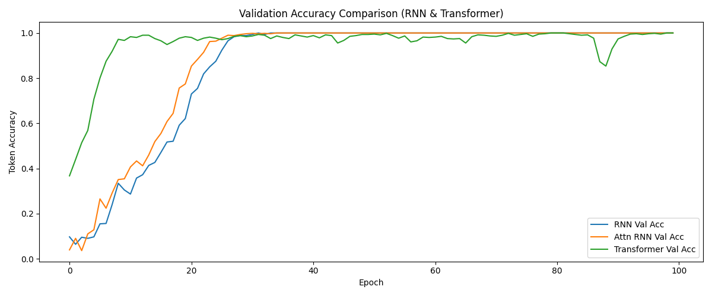
- **Training Loss Comparison (RNN vs. Transformer):**  
  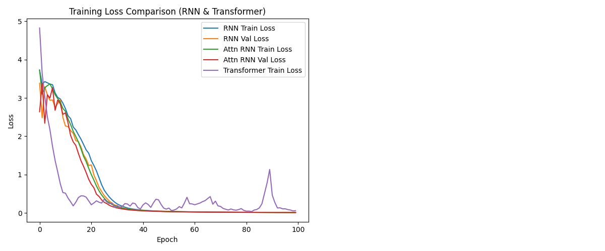

### 4.6 Analysis and Conclusion

- **RNN Models:** Both vanilla and attention-based RNNs reach near-perfect token-level accuracy, though they tend to have slower training speeds and less scalability.
- **Transformer Models:**  
  Shallow configurations (1 or 2 layers) with 2 and 4 heads perform well, while 4-layer models fail to converge on this small dataset.
- The core experiments focused on the six primary Transformer configurations (with a fixed sequence length of 20). Supplementary tests with longer sequences were also conducted but are not part of the main analysis.
- Overall, for French-to-English translation, shallow Transformer models achieve high performance with faster training times, while RNN-based models maintain consistent accuracy but with slower training speeds.

---

## General Conclusions

- **Model Selection:**  
  RNN-based architectures (especially GRU and LSTM) are highly competitive on small-scale character-level tasks and translation tasks, achieving high accuracy with lower computational cost.
  
- **Transformer Models:**  
  While Transformers offer greater flexibility and potential scalability, they require more data or further tuning to excel on smaller datasets.
  
- **Hyperparameter Sensitivity:**  
  The performance of Transformer models is very sensitive to the number of layers and attention heads. Shallow configurations (1–2 layers) with 2 and 4 heads tend to offer the best trade-off between performance and training time.
  
- **Sequence Length:**  
  Increasing the input sequence length does not always lead to improved performance; optimal lengths depend on the task and dataset size.

---

